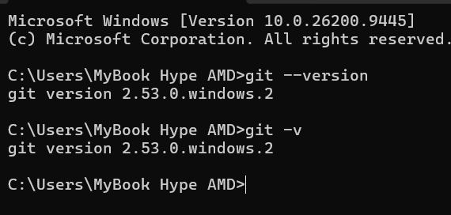
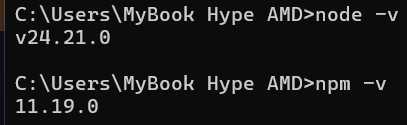
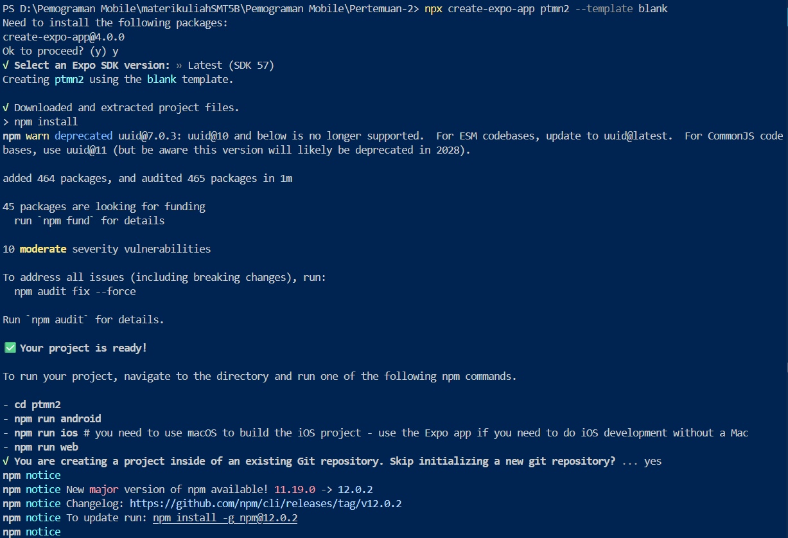

# Pratikum Menyiapkan Likungan Pengembangan dan Memulai Pemograman Mobile (React Native) #

## Tujuan Pembelajaran ##
Mahasiswa Mampu : 
1. Menyiapkan lingkungan pengembangan dan memulai pemrograman mobile (React Native)
2. Membuat aplikasi mobile dengan React Native
3. Menyelesaikan Tugas CV sederhana dengan React Native

## Materi dan Laporan Pratikum ##
1. Menyiapkan lingkungan pengembangan dan memulai pemrograman mobile (React Native)
- Memastikan instalasi Git bash
- cek instalasi Git bash (git --version)
- bukti verifikasi

- Memastikan Node.JS dan NPM
- Download dan Install Node.JS di https://nodejs.org/en/download/
- Konfirmasi Node.JS dan NPM (node-v,npm-v)

2. Membuat aplikasi / projek baru dengan React Native Framework Expo Go 
- Buka dan baca dokumentasi resmi link https://docs.expo.dev/
- Buka dan baca dokumentasi resmi link https://reactnative.dev/docs/
getting-started
- Memulai membuat projek baru
- open terminal change directory ke pertemuan-2
- masukan perintah (npx create-expo-app ptmn2 --template blank)
- bukti verifikasi

- Running Projek
    - Cd ke ptmn2
    - npx expo start
    - Install Expo Go di Android atau IOS
    - bisa juga menggunakan web emulator di Laptop / PC
    - Setelah berhentikan (ctrl + c)
    - Install (npx expo install react-dom react-native-web)
    - npx expo start --web 
    - konfirmasi keberhasilan

    

4. Tugas Praktikum
   - Membuat aplikasi CV sederhana dengan React Native
   - Nama Lengkap
   - NIM
   - Asal Sekolah
   - Cita-cita
   - Rencana Menggapai cita-cita
   - konfirmasi keberhasilan

   
