# Laporan Pratikum 3: Core Components dan Styling #

### Langkah 1: Import Library & Components ###

1. Buka File App.js yang ada di folder projek ptmn2
2. Import Library dan Components yang diperlukan 
3. Konfirmasi Bukti

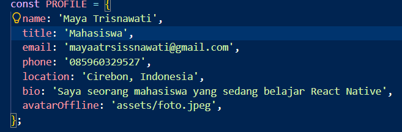

### Langkah 2: Membuat Array Project ###
1. Buat Objek Array bernama PROFILE untuk wadah data profile
2. Masukan Data yang diperlukan
3. Konfirmasi Bukti

    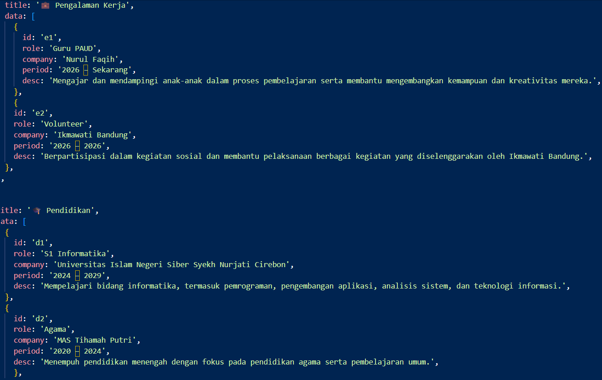

    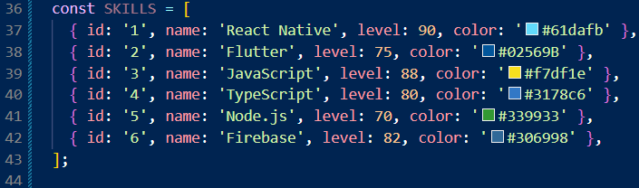

    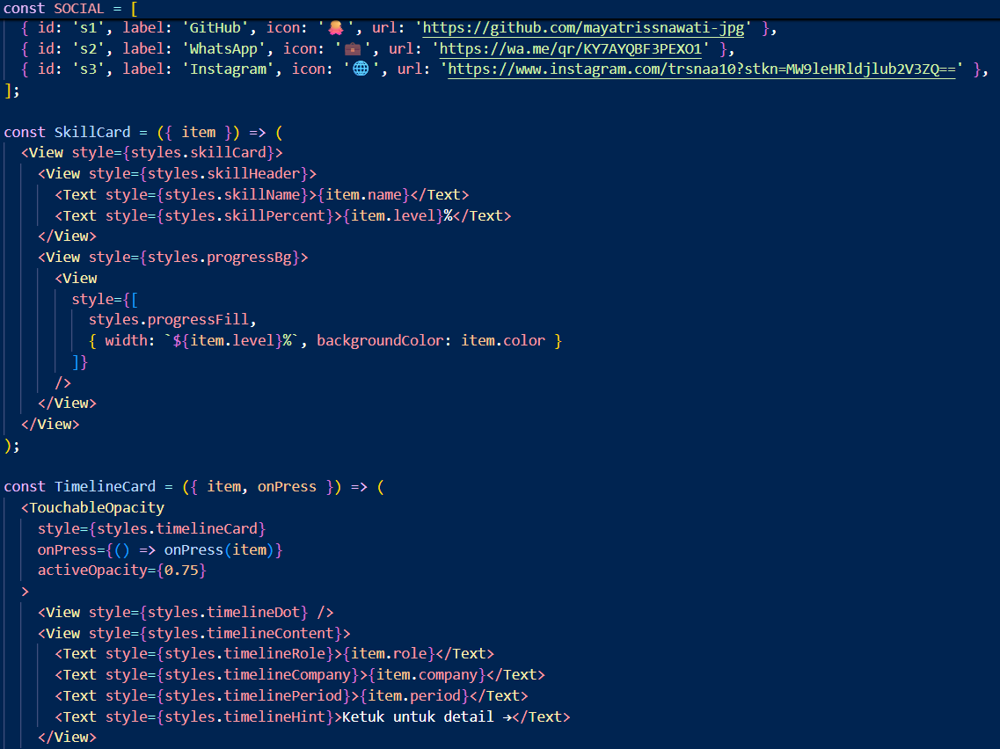

    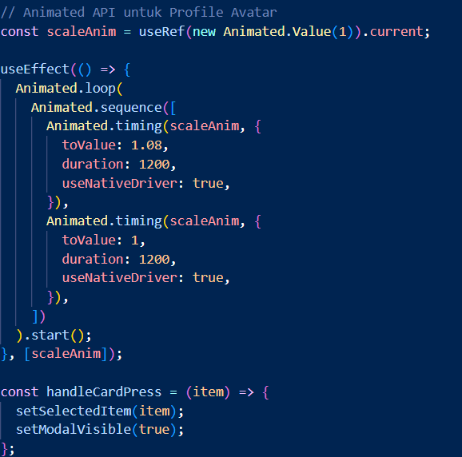

### Langka 3: Membuat Sub Components ###
1. Membuat SkillCard untuk menampilkan setiap data skill
2. Membuat Komponen Timelinecard untuk menampilkan riwayat pengalaman dan pendidikan
3. Meletakan dua sub component di antara data dan fungsi App()
4. Sub component digunakan agar kode dapat digunakan kembali

    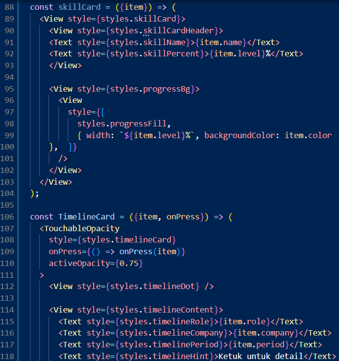

### Langkah 4: Menambahkan State dengan useState ###
1. import useState dari React.
2. Membuat state untuk mengatur data yang dapat berubah.
3. Menggunakan useState di dalam fungsi App().
4. State digunakan untuk mengatur interaksi pada aplikasi.

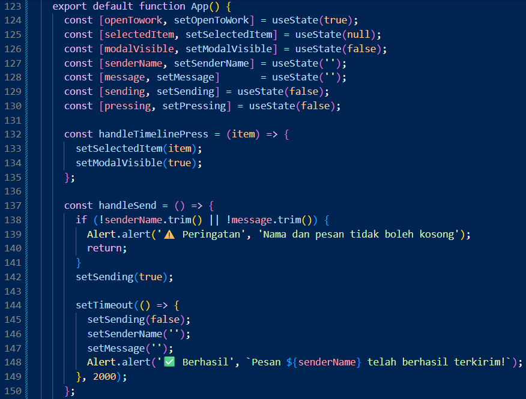

### Langkah 5: Membuat Header dengan SafeAreaView, StatusBar & Switch ###
1. Menggunakan SafeAreaView untuk membuat area aplikasi lebih aman dari notch atau home indicator.
2. Menggunakan StatusBar untuk mengatur tampilan status bar.
3. Menggunakan View dan Switch untuk membuat header aplikasi.
4. Menggunakan flexDirection: 'row' agar elemen header tersusun secara horizontal.

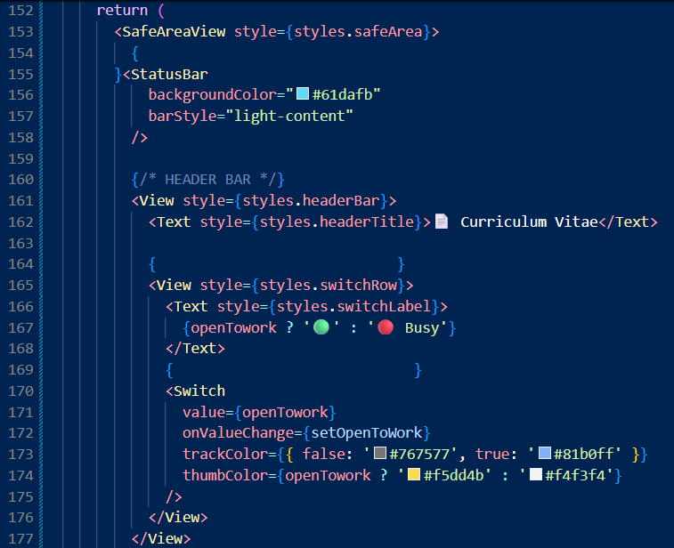

### Langkah 6: Membuat ScrollView dan Profil ###
1. Menggunakan ScrollView untuk membuat halaman dapat di-scroll.
2. Menampilkan foto profil menggunakan komponen Image.
3. Menampilkan nama, jabatan, dan bio menggunakan Text.
4. Menambahkan tombol media sosial menggunakan komponen yang tersedia.
5. Mengatur tampilan profil menggunakan styling.

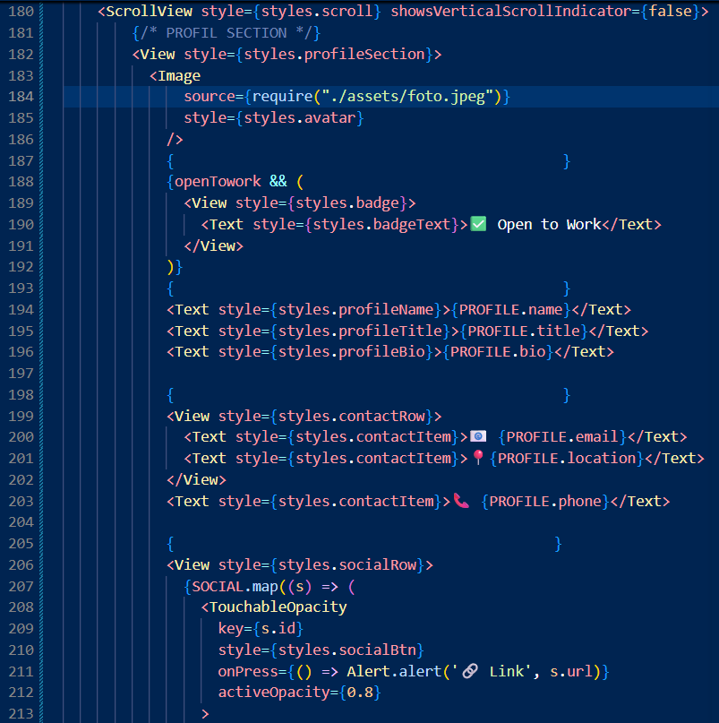
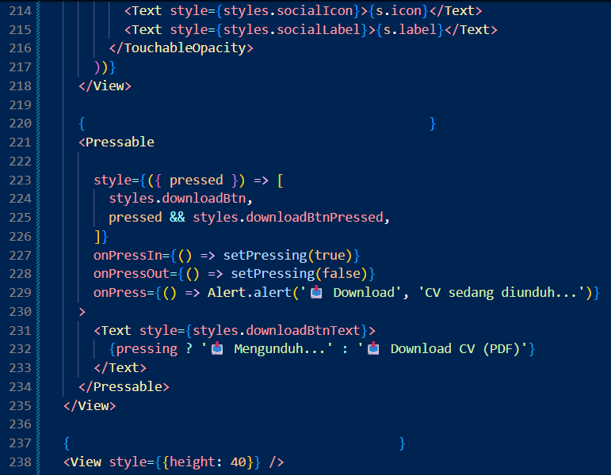

### Langkah 7: Membuat Daftar Skills dengan FlatList ###
1. Membuat section untuk menampilkan daftar skills.
2. Menggunakan FlatList untuk menampilkan data skills.
3. Menghubungkan FlatList dengan array data skills.
4. Menggunakan renderItem untuk menampilkan setiap skill.
5. Menambahkan progress bar untuk menunjukkan tingkat kemampuan.

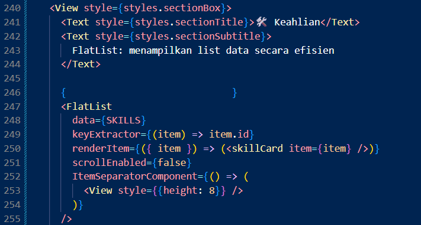

### Langkah 8: Membuat SectionList untuk Pengalaman dan Pendidikan ###
1. Membuat data riwayat pengalaman dan pendidikan.
2. Menggunakan SectionList untuk mengelompokkan data.
3. Menggunakan renderSectionHeader untuk menampilkan judul setiap kelompok.
4. Menggunakan renderItem untuk menampilkan setiap riwayat.
5. Membuat kartu riwayat menggunakan TimelineCard.

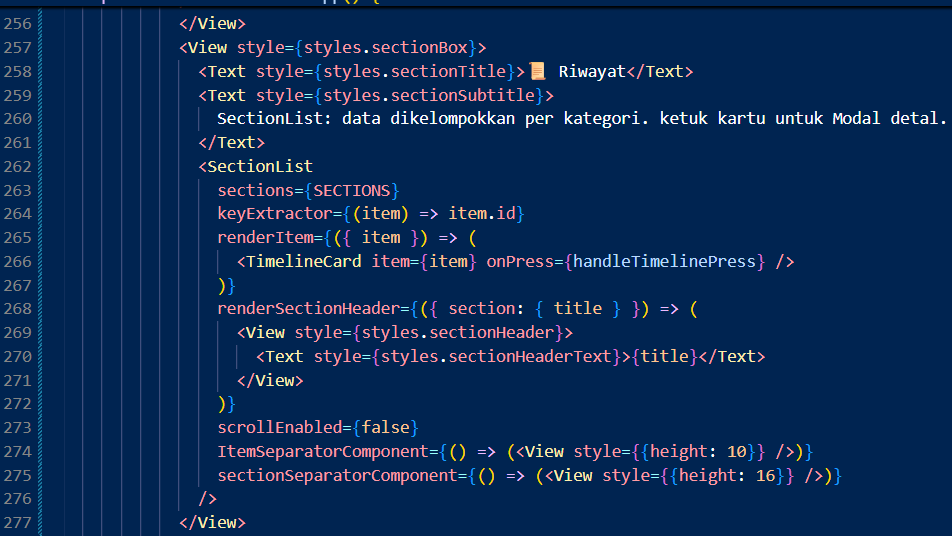

### Langkah 9: Membuat Form dengan TextInput, Button & ActivityIndicator ###
1. Membuat section form kontak.
2. Menggunakan TextInput untuk memasukkan nama dan pesan.
3. Menggunakan Button untuk mengirim pesan.
4. Menggunakan ActivityIndicator sebagai indikator loading.
5. Menambahkan proses validasi apabila input masih kosong.
6. Menampilkan pesan sukses setelah proses pengiriman selesai.

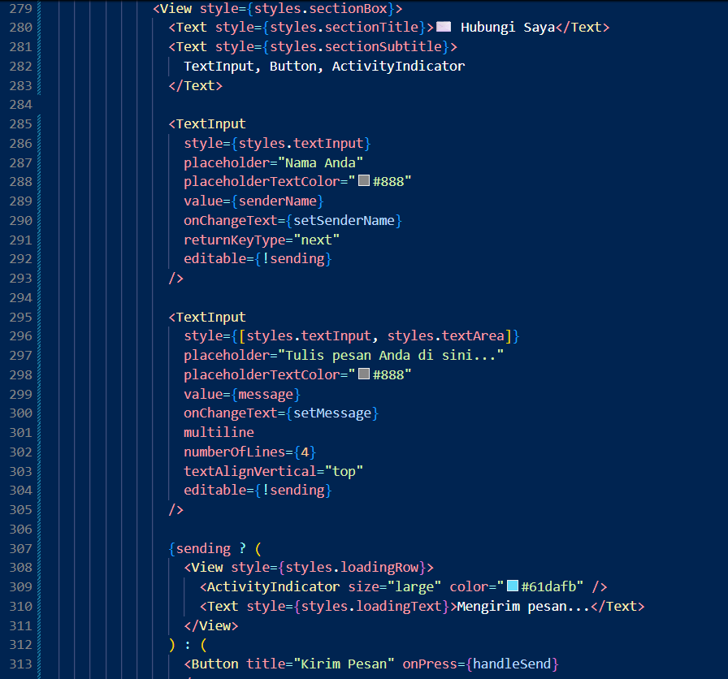

### Langkah 10: Membuat Modal Popup ###
1. Menggunakan komponen Modal.
2. Mengatur tampilan modal menggunakan state visible.
3. Modal digunakan untuk menampilkan detail riwayat.
4. Menambahkan tombol Tutup untuk menutup modal.
5. Menggunakan animationType untuk memberikan animasi pada modal.

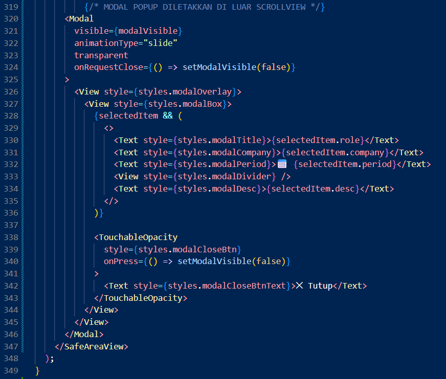

### Langkah 11:
Membuat StyleSheet ###
1. Membuat konstanta warna untuk digunakan pada aplikasi.
2. Menggunakan StyleSheet.create() untuk membuat styling secara terpusat.
3. Membuat style untuk header.
4. Membuat style untuk profil.
5. Membuat style untuk sosial media.
6. Membuat style untuk skill card.
7. Membuat style untuk timeline card.
8. Membuat style untuk form input.
9. Membuat style untuk modal.

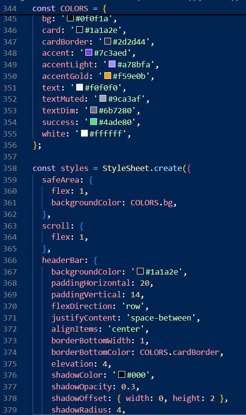
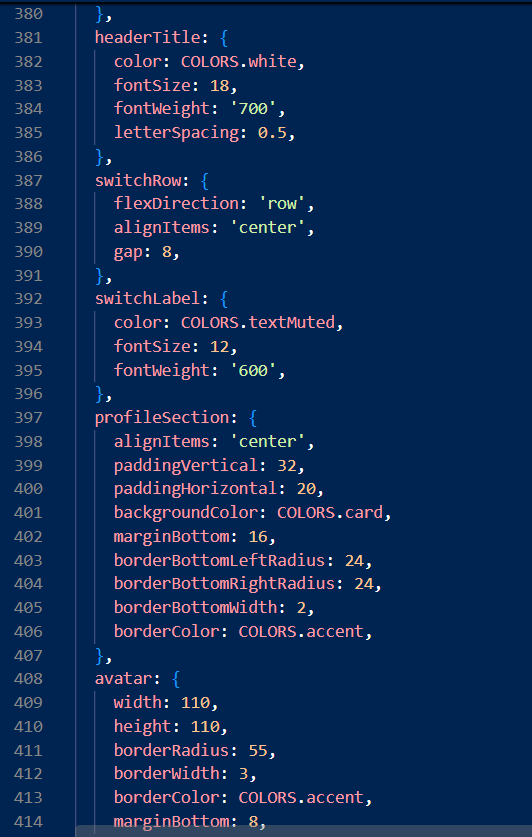
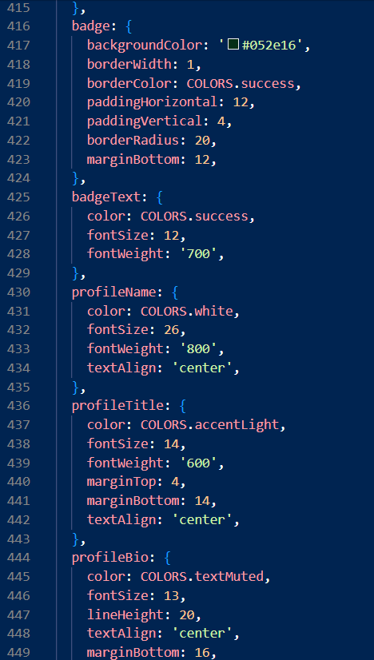
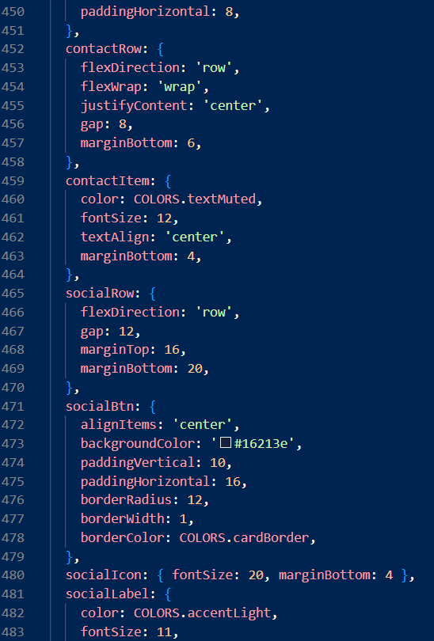

## Bukti Hasil Akhir ##

