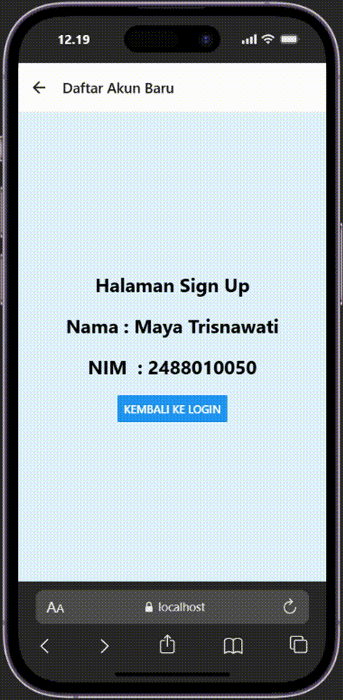
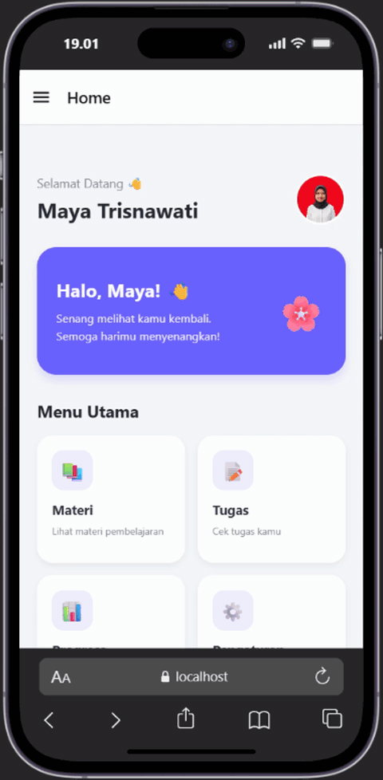

# Pratikum 4: React Native Navigation #

## Tujuan Pembelajaran ##
Mahasiswa mampu :
1. Merancang dan menerapkan navigasi antar layar (screen) pada aplikasi React Native.
2. Menggunakan library React Navigation (Stack navigator, Tab Navigator,Drawer Navigator).

## Alur Praktikum ##

### Langkah 1: Inisialisasi Proyek React Native ##
1. Buka terminal atau command prompt
2. Ubah directori ke folder pertemuan 4 (cd "Pemograman Mobile\Pertemuan-4)
3. Buat proyek baru menggunakan perintah berikut : 'npx create-expo-app ptmn4 --template blank'
4. Masuk ke dalam folder proyek menggunakan perintah berikut : 'cd ptmn4'
5. Install core navigation library (npm install @react-navigation/native)
6. Install dependensi pendukung (wajib untuk Expo) npx expo install react-native-screens react-native-safe-area-context react-native-gesture-handler react-native-reanimated

### Langkah 2: Membuat stack Navigator ###
1. Install Pustaka Stack : npm install @react-navigation/native-stack
2. Buat folder didalam projek dengan nama screens
3. Didalam folder screens buat 2 file dengan nama login.js dan signup.js
4. Masukan kode yang sesuai pada modul pratikum 4
5. Sesuaikan file App.js dengan kode yang ada di modul
6. Sinpan dan Install depedensi untuk web "npx expo install react-dom react-native-web"
7. Jalankan perintah npx expo start --web
8. Konfirmasi Bukti 

### PRAKTIKUM 2: Bottom Tab Navigation ###

### Langkah 1: Instalasi Pustaka Bottom Tabs ###
1. npm install @react-navigation/bottom-tabs

### Lanngkah 2: Membuat layar baru ###
1. Membuat file HomeScreen.js dan ProfileScreen.js di dalam folder screens

### PRAKTIKUM 3: Drawer Navigation ###

### Langkah 1: Instalasi Pustaka Drawer ###
1. npm install @react-navigation/drawer

### Langkah 2: Konfigurasi Drawer di App.js ###

